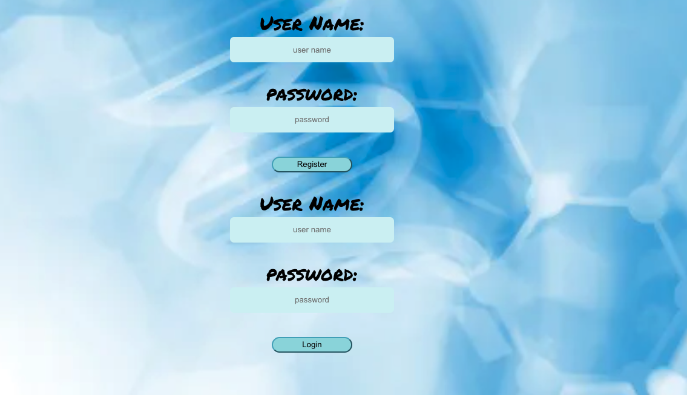
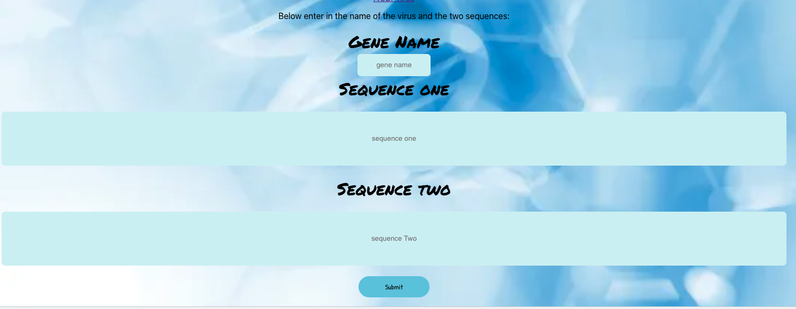
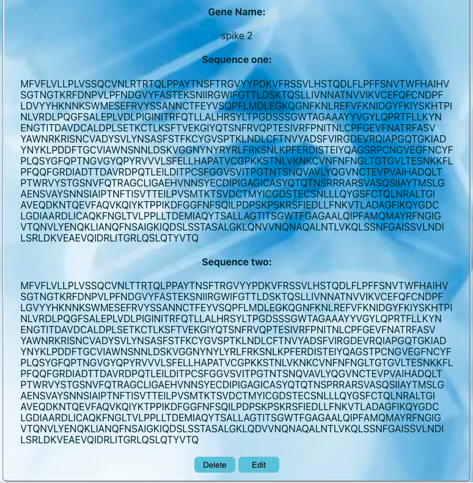
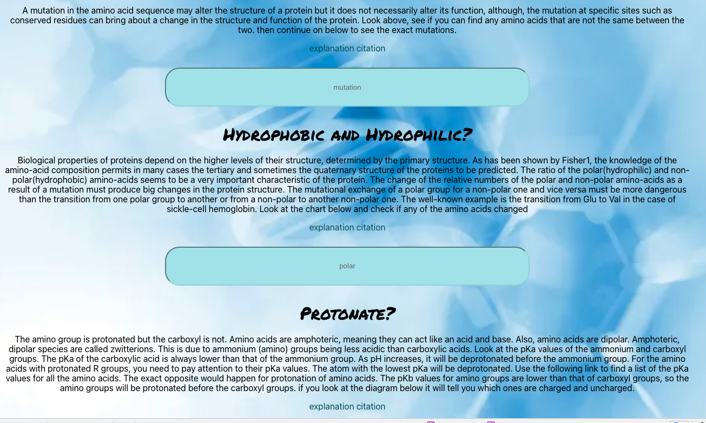

# GeneSeq
## February 2022
## By:
* Lieba Pil,
  * [GitHub](https://github.com/liebapil).
  * [Linkedin](https://www.linkedin.com/in/lieba-pil/).

### ***Front_end link***
[Front_end code](https://github.com/liebapil/geneseq-frontend)

### ***Deployment link***
* [Gene-seq](https://geneseq-frontend.herokuapp.com/)
* [Backend](https://geneseq.herokuapp.com/)

### ***Description:***
* A program that will allow you compare Amino Acid sequences, shows you the mutation and let's you know if it could effect the shape of the protein 

### ***Technologies Used:***
1. PostreSQL
2. django
3. React.js
4. Node.js
5. Heroku

### ***Getting Started***
to come

### ***Screenshots:***
# 
# 
# 
# 

### ***Planning: ***
Entity Relationship Diagram
* [ERD](https://app.diagrams.net/?libs=general;flowchart#G1-aOkE3tx9UcrPTHgRfoTq5uz8Yz19UGU)
Component Hierarchy Diagram 
* [CHD](https://app.diagrams.net/#G1zRtVbOgGUpevlZLXOpXGKJ7dqAZvDELQ)
* [Trello](https://trello.com/b/t7pWJIog/geneseq)

### ***Future Updates:***
to come

### ***Credits***

* [background image](https://st2.depositphotos.com/1762606/8529/i/600/depositphotos_85291298-stock-photo-dna-molecule-structure-background.jpg)
* [background image css](https://css-tricks.com/perfect-full-page-background-image/)
* [Amino Acid chart](https://cdn.technologynetworks.com/tn/images/body/aminoacids-pic3revised1574260662291.png)
* [canva](https://www.canva.com/)

